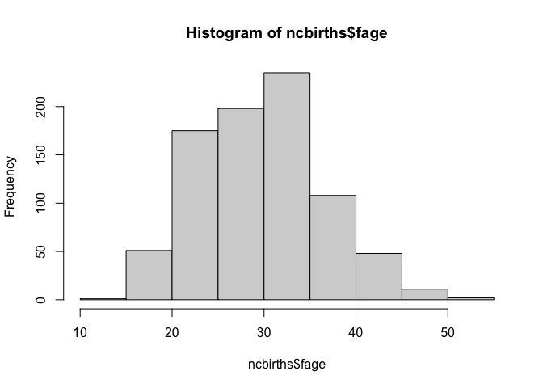
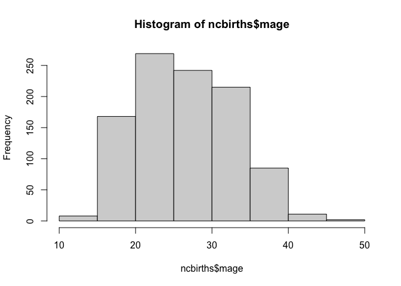
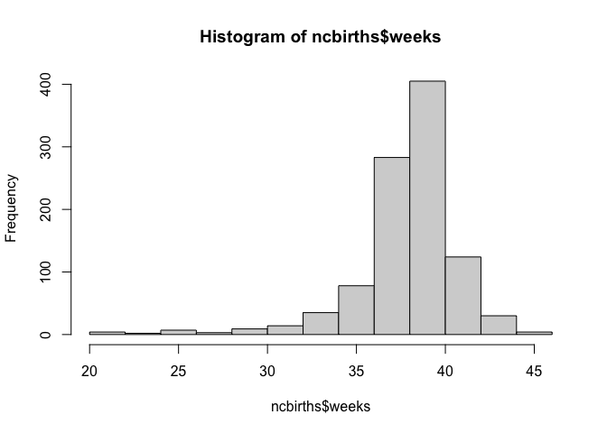
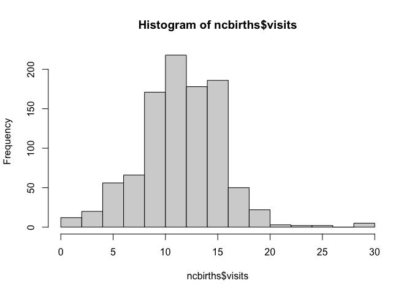
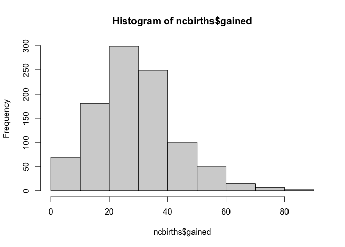
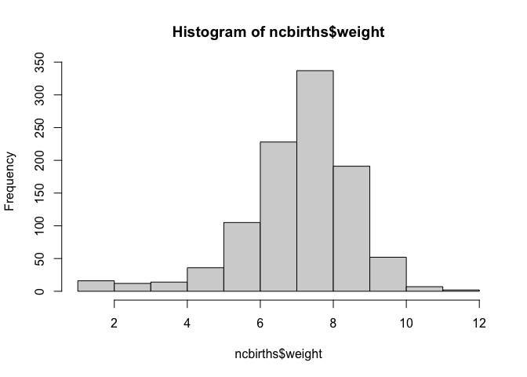
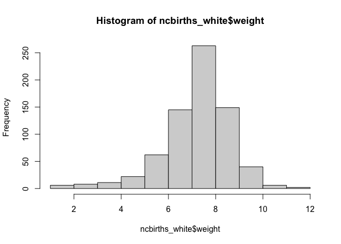
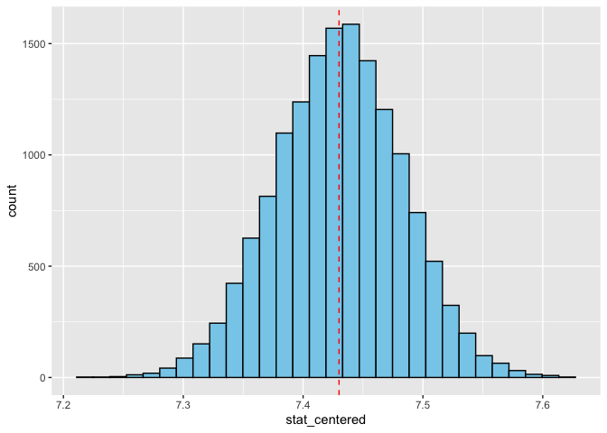
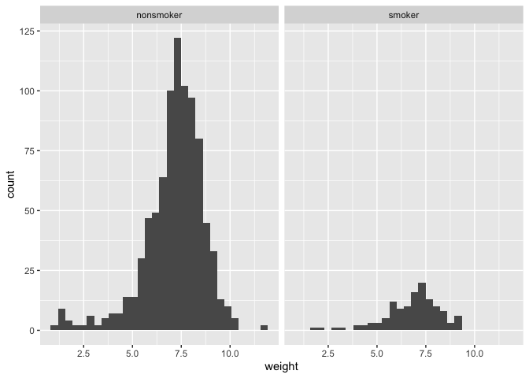

Lab 12 - Smoking during pregnancy
================
Thomas Huang
2026-04-13

# This is my 11th lab. But I choose Lab 12 as my 11th lab.

### Load packages and data

``` r
library(tidyverse)
library(infer)
library(openintro)
```

### Exercise 1

Numeric variables are fage, mage, weeks, visits, gained, and weight.

``` r
data(ncbirths)

glimpse(ncbirths)
```

    ## Rows: 1,000
    ## Columns: 13
    ## $ fage           <int> NA, NA, 19, 21, NA, NA, 18, 17, NA, 20, 30, NA, NA, NA,…
    ## $ mage           <int> 13, 14, 15, 15, 15, 15, 15, 15, 16, 16, 16, 16, 16, 16,…
    ## $ mature         <fct> younger mom, younger mom, younger mom, younger mom, you…
    ## $ weeks          <int> 39, 42, 37, 41, 39, 38, 37, 35, 38, 37, 45, 42, 40, 38,…
    ## $ premie         <fct> full term, full term, full term, full term, full term, …
    ## $ visits         <int> 10, 15, 11, 6, 9, 19, 12, 5, 9, 13, 9, 8, 4, 12, 15, 7,…
    ## $ marital        <fct> not married, not married, not married, not married, not…
    ## $ gained         <int> 38, 20, 38, 34, 27, 22, 76, 15, NA, 52, 28, 34, 12, 30,…
    ## $ weight         <dbl> 7.63, 7.88, 6.63, 8.00, 6.38, 5.38, 8.44, 4.69, 8.81, 6…
    ## $ lowbirthweight <fct> not low, not low, not low, not low, not low, low, not l…
    ## $ gender         <fct> male, male, female, male, female, male, male, male, mal…
    ## $ habit          <fct> nonsmoker, nonsmoker, nonsmoker, nonsmoker, nonsmoker, …
    ## $ whitemom       <fct> not white, not white, white, white, not white, not whit…

``` r
hist(ncbirths$fage)
```

<!-- -->

``` r
hist(ncbirths$mage)
```

<!-- -->

``` r
hist(ncbirths$weeks)
```

<!-- -->

``` r
hist(ncbirths$visits) #Seems to be an outlier / outliers.
```

<!-- -->

``` r
hist(ncbirths$gained)
```

<!-- -->

``` r
hist(ncbirths$weight)
```

<!-- -->

### Exercise 2

``` r
ncbirths_white <- ncbirths %>% 
  filter(whitemom == "white")
```

### Exercise 3

The observations should be mostly independent of each other because a
mother is unlikely to give birth to multiple babies in 2004. The sample
size is 714. It’s reasonably large. The shape of the distribution looks
normal.

``` r
glimpse(ncbirths_white)
```

    ## Rows: 714
    ## Columns: 13
    ## $ fage           <int> 19, 21, NA, 20, 30, NA, NA, 21, NA, 14, 20, 20, 26, 31,…
    ## $ mage           <int> 15, 15, 16, 16, 16, 16, 16, 16, 16, 16, 17, 17, 17, 17,…
    ## $ mature         <fct> younger mom, younger mom, younger mom, younger mom, you…
    ## $ weeks          <int> 37, 41, 38, 37, 45, 42, 38, 38, 40, 40, 40, 40, 38, 39,…
    ## $ premie         <fct> full term, full term, full term, full term, full term, …
    ## $ visits         <int> 11, 6, 9, 13, 9, 8, 12, 15, 7, 12, 8, 17, 11, 12, 8, 3,…
    ## $ marital        <fct> not married, not married, not married, not married, not…
    ## $ gained         <int> 38, 34, NA, 52, 28, 34, 30, 75, 35, 9, 20, 38, 30, 27, …
    ## $ weight         <dbl> 6.63, 8.00, 8.81, 6.94, 7.44, 8.81, 7.13, 7.56, 6.88, 5…
    ## $ lowbirthweight <fct> not low, not low, not low, not low, not low, not low, n…
    ## $ gender         <fct> female, male, male, female, male, female, female, femal…
    ## $ habit          <fct> nonsmoker, nonsmoker, nonsmoker, nonsmoker, nonsmoker, …
    ## $ whitemom       <fct> white, white, white, white, white, white, white, white,…

``` r
hist(ncbirths_white$weight)
```

<!-- -->

### Exercise 4

``` r
set.seed(123)

# Generate bootstrapped mean
ncbirths_white_boot <- ncbirths_white %>%
  specify(response = weight) %>% 
  generate(reps = 15000, type = "bootstrap") %>% 
  calculate(stat = "mean")

# Recenter the mean
ncbirths_white_boot$stat_centered <- ncbirths_white_boot$stat - mean(ncbirths_white_boot$stat, na.rm = TRUE) + 7.43

# Figure
ggplot(ncbirths_white_boot, aes(x = stat_centered)) +
  geom_histogram(fill = "skyblue", color = "black") +
  geom_vline(xintercept = 7.43, linetype = "dashed", color = "red")
```

    ## `stat_bin()` using `bins = 30`. Pick better value `binwidth`.

<!-- -->

``` r
# Two-tailed p
F <- ecdf(ncbirths_white_boot$stat_centered)
p_val <- 2*min(F(7.43), 1-F(7.43))
p_val
```

    ## [1] 0.9962667

``` r
# Interpretation
# Birth weight has not changed since 1995, p = .992.
```

### Exercise 5

Weight distribution is more centered and compact among nonsmokers. Both
distributions are left skewed.

``` r
ncbirths_r <- ncbirths %>% 
   filter(!is.na(habit))

ggplot(ncbirths_r, aes(x = weight)) +
  geom_histogram() +
  facet_wrap(~habit, ncol = 2) 
```

    ## `stat_bin()` using `bins = 30`. Pick better value `binwidth`.

<!-- -->

### Exercise 6

First, group summaries for an NA group don’t make sense. Second, NAs in
weight may cause errors when calculating group summaries (which needs
something like na.omit() to fix).

``` r
ncbirths_clean <- ncbirths %>% 
   filter(!is.na(habit), !is.na(weight))
```

### Exercise 7

This difference itself is not meaningful. It is not enough for
inference.

``` r
diff <- ncbirths_clean %>%
  group_by(habit) %>%
  summarize(mean_weight = mean(weight)) %>%
  summarize(diff = mean_weight[habit == "nonsmoker"] -
                   mean_weight[habit == "smoker"]) %>% 
  pull(diff)
```

### Exercise 8

$H_0$: The average birth weights of the two groups are the same.
Alternatively, $\mu_{Smoker}=\mu_{NonSmoker}$. $H_1$: The average birth
weights of the two groups are different. Alternatively,
$\mu_{Smoker} \neq \mu_{NonSmoker}$.

### Exercise 9

Permutation is my choice. This time I’m comparing the esimates of two
groups by first assuming the effect is 0 (null). Permutation better fits
this idea.

``` r
set.seed(123)

diffs <- replicate(5000, {
  shuffled <- ncbirths_clean %>%
    mutate(habit = sample(habit))  
  
  shuffled %>%
    group_by(habit) %>%
    summarize(m = mean(weight), .groups = "drop") %>%
    summarize(perm.diff = m[habit == "nonsmoker"] -
                     m[habit == "smoker"]) %>%
    pull(perm.diff)
})

F <- ecdf(diffs)
p <- 2 * min(F(diff), 1 - F(diff))
p
```

    ## [1] 0.0336

``` r
# p = .0336. The smnoker group is associated with lower average birth weight.
```

### Exercise 10

# The 95% CI does not include 0. This indicates the difference between the two groups is statistically significant.

``` r
diff_boot <- ncbirths_clean %>%
  specify(response = weight, explanatory = habit) %>% 
  generate(reps = 15000, type = "bootstrap") %>% 
  calculate(stat = "diff in means", order = c("nonsmoker", "smoker"))

get_confidence_interval(diff_boot, level = 0.95, type = "percentile")
```

    ## # A tibble: 1 × 2
    ##   lower_ci upper_ci
    ##      <dbl>    <dbl>
    ## 1   0.0591    0.584

### Exercise 11

By looking at the minimum and maximum in each group, the cutoff is 35.
Those who are 34 or below are considered as younger mom. And those who
are 35 or above are considered as mature mom.

``` r
psych::describeBy(ncbirths$mage, ncbirths$mature)
```

    ## 
    ##  Descriptive statistics by group 
    ## group: mature mom
    ##    vars   n  mean   sd median trimmed  mad min max range skew kurtosis   se
    ## X1    1 133 37.18 2.43     37   36.79 1.48  35  50    15 1.98     5.85 0.21
    ## ------------------------------------------------------------ 
    ## group: younger mom
    ##    vars   n  mean   sd median trimmed  mad min max range skew kurtosis   se
    ## X1    1 867 25.44 5.03     25   25.44 5.93  13  34    21 0.01    -1.03 0.17

### Exercise 12

$H_0$: The proportions of low birth weight baby are the same among
younger and mature moms. In other words, $p_{Younger} = p_{Mature}$.
$H_1$: The proportions of low birth weight baby are not the same among
younger and mature moms. In other words, $p_{Younger} \neq p_{Mature}$.

The conditions for simulation-based inference are met here. The data
points are IID. The sample size is reasonably large.

I choose bootstrapping.

The 95% CI includes zero.

$p = .0379$. The proportions of low birth weight babies are not
significantly different across mother’s maturity groups.

``` r
ncbirths_clean <- ncbirths %>% 
   filter(!is.na(lowbirthweight), !is.na(mature))

prop_boot <- ncbirths_clean %>%
  specify(lowbirthweight ~ mature, success = "low") %>%
  generate(reps = 15000, type = "bootstrap") %>%
  calculate(stat = "diff in props", order = c("mature mom", "younger mom"))

props <- prop_boot %>% 
  pull(stat)

F <- ecdf(props)
p <- 2 * min(F(0), 1 - F(0))
p
```

    ## [1] 0.3790667

### Exercise 13

The bounds mean the difference is not significant at $\alpha = .05$
because 0 is included in the 95% CI.

The CI tells that, if we resample from the population repeatedly and
calculate the CIs in the same way as we did here, 95% of the CIs will
include the true population parameter

``` r
get_confidence_interval(prop_boot, level = 0.95, type = "percentile")
```

    ## # A tibble: 1 × 2
    ##   lower_ci upper_ci
    ##      <dbl>    <dbl>
    ## 1  -0.0312   0.0910
